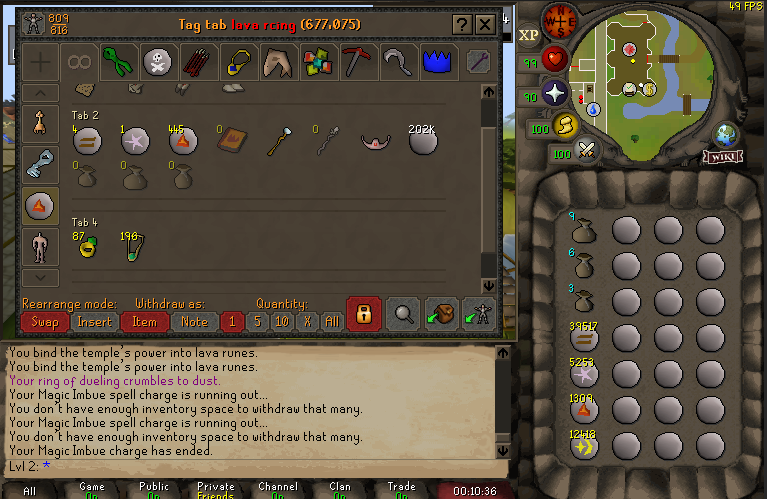

# Setup

- **Place inventory and bank as follows:** - _Note: Even scrollbar placement is crucial_
   
  

- **Click compass to point consistent north**

- **Zoom ALL the way out**

# API

## _Main Methods_

 

### Numpad0::

- buildCoordinates()

### Numpad3::

### PgUp::

### PgDn::

 

## _Helper Methods_

 

> ### buildCoordinates()

- Resets all global coordinate arrays to empty []
- Gets the position of the mouse (when executed) - must be hovering over first inventory slot
- Creates every other coordinate array based on X, Y +/- offsets of the first inventory slot
- Last, invokes getJewelryCharges() which prompts user for input to set initial jewelry charges (tracking)

 

> ### getJewelryCharges()

- Prompts the user for two integer inputs (BindingNecklace charges & Ring of Dueling charges)
- Sets global RoD & BindingNecklace charge values for tracking

 

> ### randVariances()

- Creates & returns 'variancesObject' which contains:
  1. actionDelayLong ........ 725 - 900 ms
  2. actionDelayShort ....... 425 - 725 ms
  3. mouseSpeedFast ......... 2.1 - 3.1
  4. mouseSpeedSlow ......... 3.1 - 4.1
  5. pixelDev ........................... -3, 3 (+-6 pixels)
  6. imbueDelay ....................... 2050 - 2175 ms
  7. bankMiniMapDelay ........ 3400 - 3550 ms
  8. bankOpenDelay ............... 1500 - 1625 ms
  9. cactusClickDelay .............. 2400 - 2500 ms

 

> customMouseMove()

- Takes X & Y coordinate arguments
- Generates pixelDev and mouseSpeed variances using randVariances() return obj.
- Moves mouse to X, Y position
- Generates new variance obj and moves to same position (with new variances) to slightly move mouse - organic movement

 

> clickAllPouches

- Uses global inventoryCoordinates to click pure essence Pouches in inventory slots
- Creates randomActionDelayShort
- Takes an argument to determine wether or not to SHIFT + CLICK (empty pouches @ altar) or regular Left Click (fill pouches @ bank)
- Sleeps at the end of actions for 425-725 ms

 

> withdrawEssence()

- Uses global bankCoords variable with customMouseMove() to right click pure essence > withdraw all >

 

> openBank()

 

> teleportTo()

 

> castImbue()

 

> useEarthRunesWithAltar()

 

> craftLavaRunes()

 

> equipNewJewelry()

 

> checkJewelryCharges()

- Uses global variables for RoDCharges & bindingNecklaceCharges to check current charges
- If Ring / Necklace charges = 0, equips that item
- Resets charges for each item equipped

 
